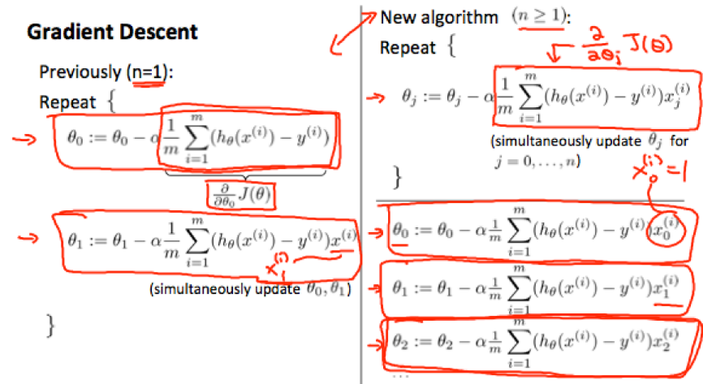
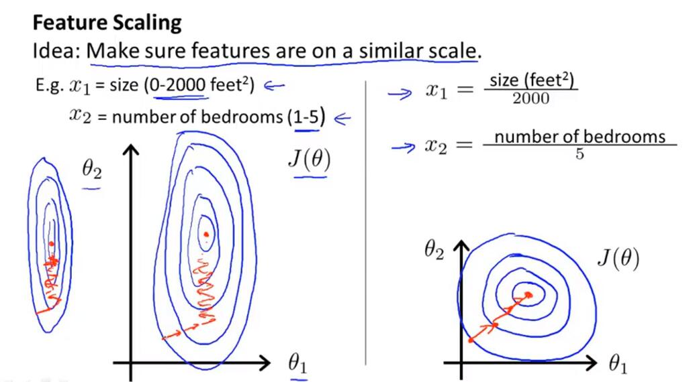

# 多变量线性回归

​	在房屋价格预测问题中，当影响房屋售价的因素不止一个时，需要考虑使用多变量回归解决问题。规定：

​	 $x_j^{(i)}​$ 表示第 i 个样本的第 j 个特征值，m表示样本数目，n表示特征维度

​	此时的线性回归假设模型：
$$
h_\theta(x) = \theta_0 + \theta_1x_1 + \theta_2x_2 + \theta_3x3 + ... + \theta_nx_n
$$
​	可写成矩阵乘法的形式：
$$
h_\theta(x) = [\theta_0\ \theta_1\ ...\ \theta_n] \left[
 \begin{matrix}
 x_0\\ x_1\\ \vdots\\x_n
  \end{matrix}
  \right]=\theta^Tx
$$

​	注意，为了表示方便，在实际计算时， $x_0^{(i)}=1\ for (i\in 1,2,\dots,m)$ 

+ ## 多变量的梯度下降

　　多变量线性回归的假设模型相比单变量的线性回归并没有本质的区别，对于各个模型参数 $\theta​$ 而言，它们的更新方程是一致的。

repeat until convergence: {
$$
\theta_0 = \theta_0 - \alpha\frac{1}{m}\sum_{i=1}^{m}(h_\theta(x^{(i)}-y^{(i)}))\cdot x_0^{(i)} \\
\theta_1 = \theta_1 - \alpha\frac{1}{m}\sum_{i=1}^{m}(h_\theta(x^{(i)}-y^{(i)}))\cdot x_1^{(i)} \\
\theta_2 = \theta_2 - \alpha\frac{1}{m}\sum_{i=1}^{m}(h_\theta(x^{(i)}-y^{(i)}))\cdot x_2^{(i)} \\
\dots
$$
}

换言之，
$$
\theta_j = \theta_j - \alpha\frac{1}{m}\sum_{i=1}^{m}(h_\theta(x^{(i)}-y^{(i)}))\cdot x_j^{(i)} \qquad for\ j:=0\dots n
$$
**注意**，每一项 $\theta$ 在求和符号内，都需要乘上对应的一项 $x_j^{(i)}$

+ ## 特征缩放（feature scaling）

　　在进行多变量的线性回归实践之前，还有一个需要考虑的问题是特征缩放的问题。假设，如果某一特征的取值范围在 [-1, 1] 之间，而另一项特征的取值范围在 [-1000, 10000]之间，那么可能导致cost function的形态如下图左边所示，这将导致在梯度下降过程中产生 震荡。右图所示的是进行了特征归一化处理的cost function，可以看出这样的处理可以使得梯度下降法更加稳定。

​	**特征缩放的方法**
$$
x_i = \frac{x_i-u_i}{s_i}
$$
​	（5）式中， $u_i$ 表示第 i 个特征的平均值， $s_i$ 表示该特征的范围（最大值与最小值之差），$s_i$ 也可以是该特征值的标准差。例如，如果 $x_i$ 表示房屋的价格，并且在100到2000之间，均值为1000，那么特征缩放后的每一个 $x_i$ 应为 $x_i=\frac{price-1000}{19000}$ 

+ ## 多项式回归

　　此前所讨论的都是线性回归的内容，假设模型中不包含高次项，这样的模型有局限性，在某些场景可能表现不佳。因此我们可以对这些多个特征进行组合，例如对于一个双变量的问题，将 $x_1$ 和 $x_2$ 组合成一个新的特征 $x_3$ ，使得 $x_3 = x_1 \cdot x_2$ ,再对这三个特征应用线性回归就实现了多项式回归。以下为一些假设模型的举例：
$$
h_\theta(x) = \theta_0+\theta_1x_1+\theta_2x_1^2 \\
h_\theta(x) = \theta_0+\theta_1x_1+\theta_2\sqrt{x_1} \\
h_\theta(x) = \theta_0+\theta_1x_1+\theta_2x_1^2 +\theta_3x_1^3 \\
$$
​	在实践例子中会有举例，**注意假设的多项式模型应当是完备的**（即如果想要拟合的最高次幂为2次，特征维度为2时，模型应该是惟一的：$h_\theta=\theta_0+\theta_1x_1+\theta_2x_2+\theta_3x_1^2+\theta_4x_2^2+\theta_5x_1x_2$）

此时，由于产生了多个特征项，特征缩放工作显得更加重要。

eg. if  $x_1$ has range 1 - 1000 then range of $x_1^2$ becomes 1 - 1000000 and that of $x_1^3​$ becomes 1 - 1000000000

 

+ ## 解决回归问题的直接法：正规方程法（法方程）

